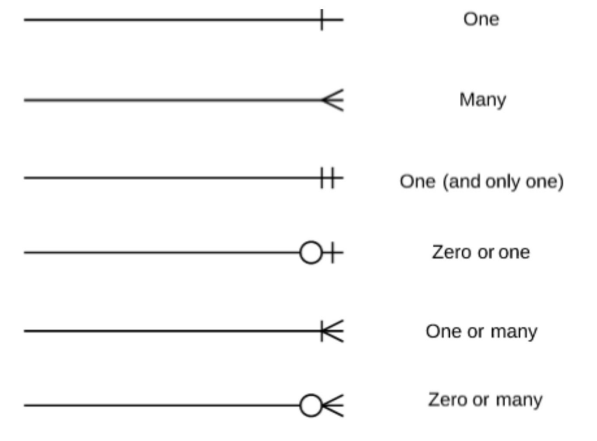
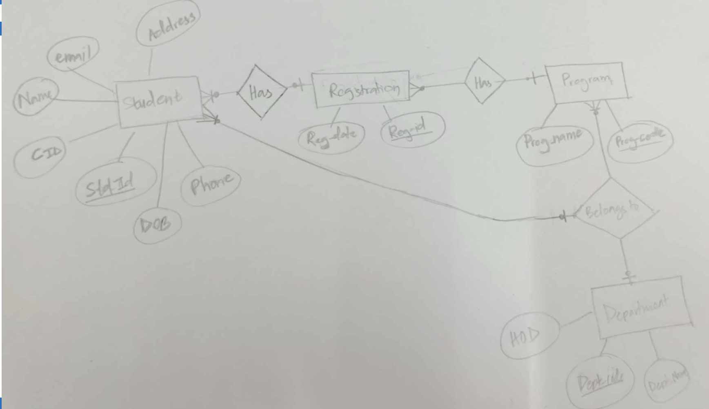

# Database Systems Fundamentals

## Introduction

As part of my coursework in Database Systems Fundamentals (DBS101), I've been exploring the core concepts of database design and implementation. This learning portfolio reflects my understanding of entity-relationship diagrams (ERDs), relational models, and database schema design - the foundation of any robust database system.

## Understanding Entity-Relationship Diagrams

The entity-relationship model has been one of the most enlightening concepts I've learned. It provides a structured way to visualize real-world relationships before implementing them in a database. An ERD consists of three main components:

1. **Entities** - These represent real-world "things" or "objects" that are distinguishable from other objects. In class, we learned to identify these as nouns in our system requirements.

2. **Attributes** - These are the descriptive properties possessed by each entity. I found it interesting how attributes can be categorized as:
   - Simple attributes (not divided into subparts)
   - Composite attributes (can be divided into subparts)
   - Single-valued attributes (have a single value for a particular entity)
   - Multi-valued attributes (have more than one value for a particular entity)
   - Derived attributes (value can be derived from other attributes)

3. **Relationships** - These represent associations among entities. I learned that relationships often correspond to verbs in system requirements.

The concept of primary keys was crucial - understanding that every entity needs unique identification through one or more attributes. I appreciated how primary keys are visually indicated in ERDs by underlining the attribute.

## Mapping Cardinalities

Mapping cardinalities has been one of the more challenging yet rewarding concepts to grasp. These express the number of entities to which another entity can be associated via a relationship set:

1. **One-to-One (1:1)** - An entity in A is associated with at most one entity in B, and vice versa
2. **One-to-Many (1:N)** - An entity in A can be associated with any number of entities in B, but an entity in B is associated with at most one entity in A
3. **Many-to-One (N:1)** - The inverse of one-to-many
4. **Many-to-Many (M:N)** - Entities in both sets can be associated with any number of entities in the other set

I particularly liked learning about the Crow's Foot notation for representing these relationships, as it's visually intuitive and used widely in the industry.

## From ERD to Relational Schema

One of the most practical skills I've developed is translating ERDs into relational schemas. This process follows specific rules:

1. Create a table for each entity, where:
   - Single-valued attributes become columns
   - Primary key attributes become primary keys of the table
   - Multi-valued attributes get separate tables
   - For composite attributes, only sub-attributes become columns
   - Derived attributes are not included as columns

2. Converting relationships based on cardinality:
   - For 1:1 relationships, the primary key of the entity with total participation becomes a foreign key in the other entity
   - For 1:N relationships, the primary key of the "one" entity becomes a foreign key in the "many" entity
   - For M:N relationships, create a new relation with primary keys from both entities as its composite primary key

I found the handling of specialized cases particularly interesting, such as:
- Ternary relationships (requiring a new table with primary keys from all participating entities)
- Unary relationships (relationships between occurrences of the same entity)
- Weak entities (entities without key attributes)

## Relational Algebra

Learning about relational algebra provided me with the theoretical foundation for database operations. The key operations I learned include:

- **Selection (σ)** - Filtering tuples based on conditions
- **Projection (π)** - Selecting specific attributes
- **Union (∪)** - Combining tuples from two relations
- **Intersection (∩)** - Finding common tuples between relations
- **Difference (-)** - Finding tuples in one relation but not in another
- **Cartesian Product (×)** - Creating all possible tuple combinations between relations
- **Join (⋈)** - Combining related tuples from different relations

Understanding these operations has helped me see how complex database queries can be broken down into fundamental operations.

## Personal Reflections

Converting theory into practice has been challenging but rewarding. When designing the ERD for the student registration system at CST (our homework assignment), I realized how important it is to thoroughly understand the real-world system before attempting to model it.

I struggled initially with identifying the appropriate relationships between entities like students, courses, and departments. However, applying the cardinality concepts helped me clarify these relationships.

The most valuable insight I've gained is the importance of proper database design. A well-designed database with appropriate entities, relationships, and normalized structure provides a solid foundation for any information system.

## Conclusion

This module has significantly enhanced my understanding of database systems fundamentals. Moving forward, I plan to deepen my knowledge by exploring advanced concepts such as normalization, transaction management, and query optimization. I believe these skills will be invaluable in my future career in software engineering, where most applications rely on efficient database design and implementation.

As I continue learning, I hope to apply these concepts in real-world scenarios, enhancing my problem-solving abilities and developing a deeper understanding of theoretical principles through practical implementation.