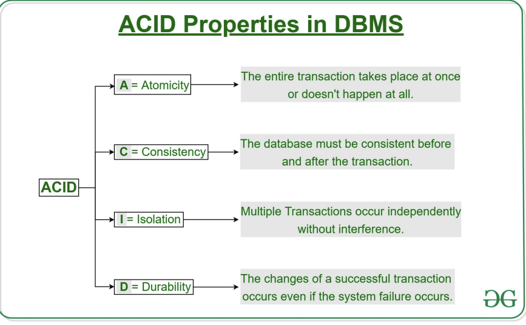
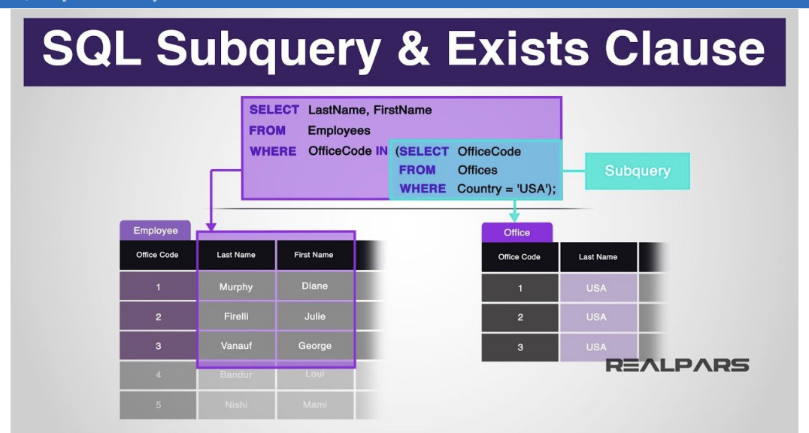

# Database Systems Fundamentals

## Introduction

As I go deeper into the world of database management, my recent lessons in Database Systems have been both challenging and enlightening. These sessions have provided me with a detailed understanding of SQL, from its basic concepts to more advanced operations.

## Key Learnings

### 1. Understanding ACID Properties
One of the fundamental concepts I learned is the ACID properties of databases:
- **Atomicity**: Ensuring data remains atomic and indivisible
- **Consistency**: Preserving the integrity of data values
- **Isolation**: Maintaining separation between database transactions
- **Durability**: Guaranteeing the permanence of data

### 2. SQL Basics and Table Creation
I've learned how to create databases and tables, understanding the importance of:
- Defining table schemas
- Setting up primary and foreign key constraints
- Selecting appropriate data types (VARCHAR, INT, TIMESTAMP)

### 3. Data Manipulation Techniques
My skills now include:
- Inserting data into tables
- Selecting and filtering data using WHERE clauses
- Performing complex queries across multiple tables
- Using operators like AND, OR, and LIKE for precise data retrieval

### 4. Advanced SQL Concepts
I've explored more complex database techniques:
- Handling NULL values and their unique logic
- Using aggregate functions (AVG, MIN, MAX, COUNT)
- Working with GROUP BY and HAVING clauses
- Understanding nested subqueries
- Implementing set operations

## Practical Project: Airline Ticketing Database
As part of my learning, I created a comprehensive Airline Ticketing Database with tables for:
- Users
- Flights
- Tickets
- Payments
- Cancellations

This hands-on project helped me apply theoretical knowledge to a real-world scenario.

## Challenges and Understandings
- SQL's three-valued logic with NULL values was particularly challenging
- Understanding the complex ways of handling NULL in different operations
- Learning to write efficient and precise queries ..

## Future Learning Goals
- Master more advanced SQL techniques
- Explore database optimization
- Learn about database design principles
- Dive deeper into transaction management

## Conclusion
My journey into SQL has been more than just learning a programming language; it's been an exploration of how data breathes life into modern technology. Each query I craft is a proof to the power of structured information, transforming raw data into meaningful insights that drive decision-making across industries.

As I stand at the intersection of technical skill and strategic thinking, I realize that SQL is not just a tool, but a key that unlocks the potential of data-driven innovation. The road ahead is filled with endless possibilities, and I'm excited to continue pushing the boundaries of my understanding, one line of code at a time.