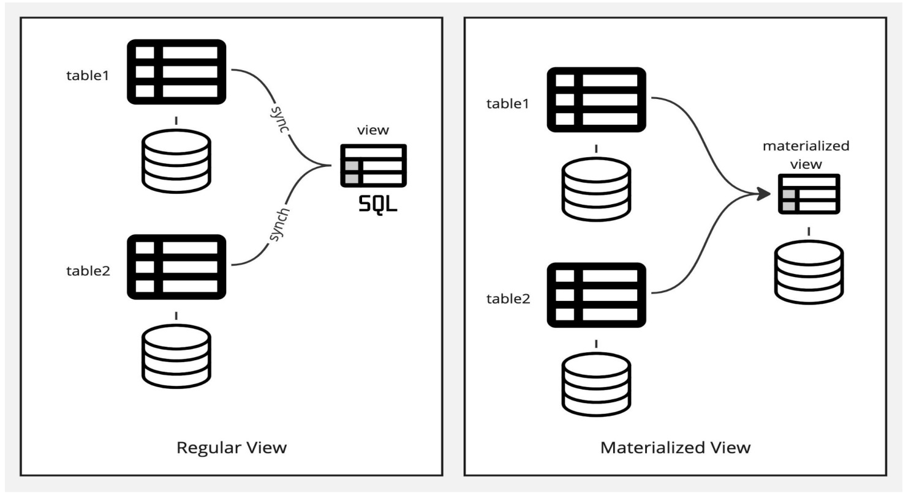

# Database Systems Learning Portfolio: SQL Advanced Features

## Executive Summary
This learning portfolio documents my understanding and reflections on advanced SQL features covered in Lessons 9-12 of the Database Systems course. The portfolio covers SQL joins, views, integrity constraints, indexes, authorization, functions, procedures, triggers, and recursive queries. These concepts form the foundation for developing sophisticated database applications and maintaining data integrity in relational database systems.

## 1. SQL Joins
### 1.1 Natural Join
- Performs Cartesian product between tables
- Finds consistent tuples and removes inconsistent ones
- Deletes duplicate attributes
- Requires at least one common attribute between tables

### 1.2 Inner Join
- Default join type when using the JOIN clause
- Returns only matched records from both tables
- Equivalent to NATURAL INNER JOIN

### 1.3 Outer Joins
| Join Type | Includes Matched Rows | Includes Unmatched Left Table Rows | Includes Unmatched Right Table Rows |
|-----------|:---------------------:|:----------------------------------:|:-----------------------------------:|
| INNER JOIN | ✓ | ✗ | ✗ |
| LEFT JOIN | ✓ | ✓ | ✗ |
| RIGHT JOIN | ✓ | ✗ | ✓ |
| FULL OUTER JOIN | ✓ | ✓ | ✓ |

#### Example of LEFT OUTER JOIN:
```sql
SELECT * FROM Patient LEFT JOIN Appointment 
ON Patient.PatientID = Appointment.PatientID;
```

## 2. SQL Views
### 2.1 Definition
A view is a virtual table based on the result of an SQL statement. Unlike traditional tables, views do not store data physically but retrieve it dynamically when accessed.

### 2.2 Key Characteristics
- Simplifies complex queries
- Enhances database security by restricting access
- Presents data in a customized format

### 2.3 Types of Views
- **Regular Views:** Re-evaluated each time they're accessed
- **Materialized Views:** Stored physically but updated when base tables change


### 2.4 View Definition Example
```sql
CREATE VIEW swefaculty AS
SELECT ID, name, deptname
FROM instructor
WHERE deptname='swe';
```

### 2.5 Updatable Views
A SQL view is updatable if:
- The FROM clause has only one database relation
- The SELECT clause contains only attribute names (no expressions/aggregates)
- Any attribute not listed can be set to null
- The query does not have GROUP BY or HAVING clauses

## 3. Integrity Constraints
### 3.1 Types of Constraints
1. Entity Integrity Constraints
2. Domain Constraints
3. Referential Integrity Constraints
4. Key Constraints

### 3.2 Implementation
Constraints are identified during database schema design and declared as part of CREATE TABLE commands to ensure data consistency.

## 4. SQL Data Types and Schemas
### 4.1 Date and Time Types
SQL provides specialized types for handling temporal data.

### 4.2 Large Object Types
- **CLOB (Character Large Object):** For text data
- **BLOB (Binary Large Object):** For binary data

### 4.3 PostgreSQL Large Object Types
1. BYTEA (< 1MB)
2. TEXT (< 1GB)
3. Large Object (< 4TB)
4. JSONB (< 1GB)
5. XML (< 1GB)

### 4.4 User-Defined Types
```sql
CREATE TYPE Dollars AS NUMERIC(12,2) FINAL;
```

### 4.5 Auto-Increment Features
```sql
-- Standard SQL
ID NUMBER(5) GENERATED ALWAYS AS IDENTITY

-- PostgreSQL
ProcedureID SERIAL PRIMARY KEY
```

## 5. Indexes
### 5.1 Definition
An index is a data structure that allows the database system to efficiently find tuples with specific attribute values without scanning the entire relation.

### 5.2 Creating Indexes
```sql
CREATE INDEX deptindex ON instructor (deptname);
```

### 5.3 Unique Indexes
```sql
CREATE UNIQUE INDEX deptindex ON instructor (deptname);
```

## 6. Authorization in SQL
### 6.1 Privilege Types
- SELECT: Allows reading data
- INSERT: Allows adding new data
- UPDATE: Allows modifying data
- DELETE: Allows removing data
- EXECUTE: Allows running functions/procedures

### 6.2 Granting Privileges
```sql
GRANT <privilege list> ON <relation name> TO <user/role>;
```

### 6.3 Role-Based Authorization
```sql
CREATE ROLE instructor;
GRANT SELECT ON department TO instructor;
```

### 6.4 Revoking Privileges
```sql
REVOKE <privilege list> ON <relation name> FROM <user/role>;
```

## 7. Functions and Procedures
### 7.1 Functions vs. Procedures

| Characteristic | SQL Function | SQL Procedure |
|----------------|-------------|--------------|
| Definition | CREATE FUNCTION | CREATE PROCEDURE |
| Execution | Within SELECT statements | Explicitly called with EXECUTE |
| Return Value | Always returns a single value | May or may not return a value |
| Purpose | Single calculation/operation | Series of actions |
| Parameters | Input only | Input and output |

### 7.2 Function Example
```sql
CREATE OR REPLACE FUNCTION get_patient_appointments(p_patient_id INT)
RETURNS TABLE (
  appointment_id INT,
  appointment_date DATE,
  appointment_time TIME,
  purpose VARCHAR(255)
) AS $$
BEGIN
  RETURN QUERY
  SELECT
    a.AppointmentID,
    a.AppointmentDate,
    a.AppointmentTime,
    a.Purpose
  FROM
    Appointment a
  WHERE
    a.PatientID = p_patient_id
  ORDER BY
    a.AppointmentDate, a.AppointmentTime;
END; $$ LANGUAGE plpgsql;
```

### 7.3 Procedure Example
```sql
CREATE OR REPLACE PROCEDURE schedule_appointment(
  p_patient_id INT,
  p_doctor_id INT,
  p_appointment_date DATE,
  p_appointment_time TIME,
  p_purpose VARCHAR(255)
)
LANGUAGE plpgsql
AS $$
DECLARE
  next_appointment_id INT;
  doctor_availability BOOLEAN;
BEGIN
  -- Check doctor availability
  SELECT COUNT(*) = 0 INTO doctor_availability
  FROM Appointment
  WHERE DoctorID = p_doctor_id
    AND AppointmentDate = p_appointment_date
    AND AppointmentTime = p_appointment_time;
    
  IF NOT doctor_availability THEN
    RAISE EXCEPTION 'Doctor is not available at the requested time';
  END IF;
  
  -- Get next appointment ID
  SELECT COALESCE(MAX(AppointmentID), 0) + 1 INTO next_appointment_id 
  FROM Appointment;
  
  -- Insert new appointment
  INSERT INTO Appointment (
    AppointmentID, PatientID, DoctorID,
    AppointmentDate, AppointmentTime, Purpose
  ) VALUES (
    next_appointment_id, p_patient_id, p_doctor_id,
    p_appointment_date, p_appointment_time, p_purpose
  );
  
  RAISE NOTICE 'Appointment scheduled successfully. Appointment ID: %', 
    next_appointment_id;
END;
$$;
```

## 8. Triggers
### 8.1 Definition
A trigger is a statement that the system executes automatically as a side effect of a modification to the database.

### 8.2 Use Cases
- Enforcing integrity constraints beyond SQL's built-in mechanisms
- Alerting users when specific conditions are met
- Updating related tuples in other relations

### 8.3 Trigger Example
```sql
CREATE OR REPLACE FUNCTION notify_new_prescription()
RETURNS TRIGGER AS $$
BEGIN
  RAISE NOTICE 'New prescription added: % for patient % (Medication: %)',
    NEW.PrescriptionID, NEW.PatientID, NEW.MedicationName;
  RETURN NEW;
END;
$$ LANGUAGE plpgsql;

CREATE TRIGGER after_prescription_insert
AFTER INSERT ON Prescription
FOR EACH ROW
EXECUTE FUNCTION notify_new_prescription();
```

## 9. Recursive Queries
### 9.1 Definition
A recursive SQL common table expression (CTE) is a query that continuously references a previous result until it returns an empty result.

### 9.2 Implementation
```sql
WITH RECURSIVE R AS (
  -- Base case (non-recursive term)
  SELECT 1 AS n
  UNION ALL
  -- Recursive term
  SELECT n + 1 FROM R WHERE n < 10
)
SELECT * FROM R;
```

### 9.3 Restrictions
Recursive queries must be monotonic and cannot use:
- Aggregation on the recursive view
- NOT EXISTS on subqueries using the recursive view
- Set difference operations using the recursive view

## 10. Database Connectivity
### 10.1 Approaches
- **Dynamic SQL:** Connect to databases through APIs like JDBC (Java) or ODBC
- **Embedded SQL:** SQL statements identified at compile time through a preprocessor

## 11. Personal Reflections
The advanced SQL features covered in these lessons have significantly expanded my understanding of database capabilities. I find triggers and stored procedures particularly valuable for encapsulating business logic within the database itself. The ability to create views provides an elegant way to abstract complex queries and enhance security.

Moving forward, I intend to:
1. Experiment with PostgreSQL by installing pgAdmin 4
2. Develop a small project implementing functions, procedures, and triggers
3. Practice optimizing queries using appropriate indexes
4. Explore recursive queries for hierarchical data models

